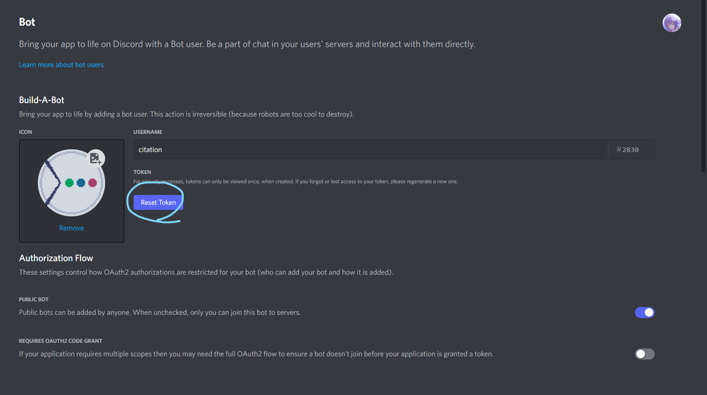
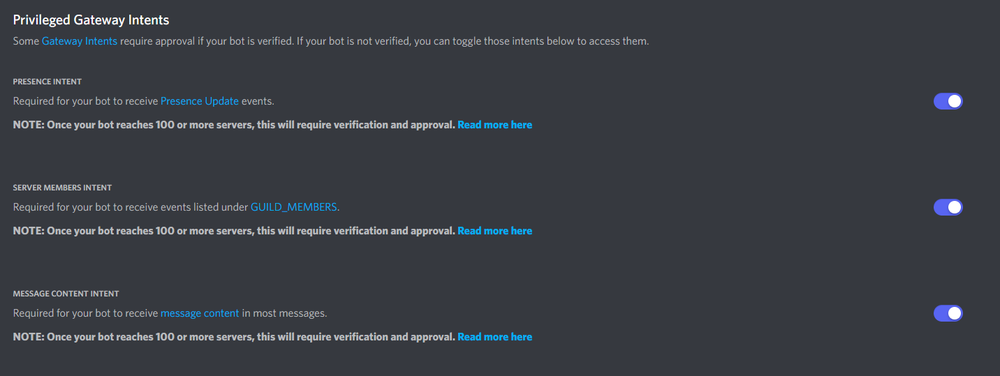
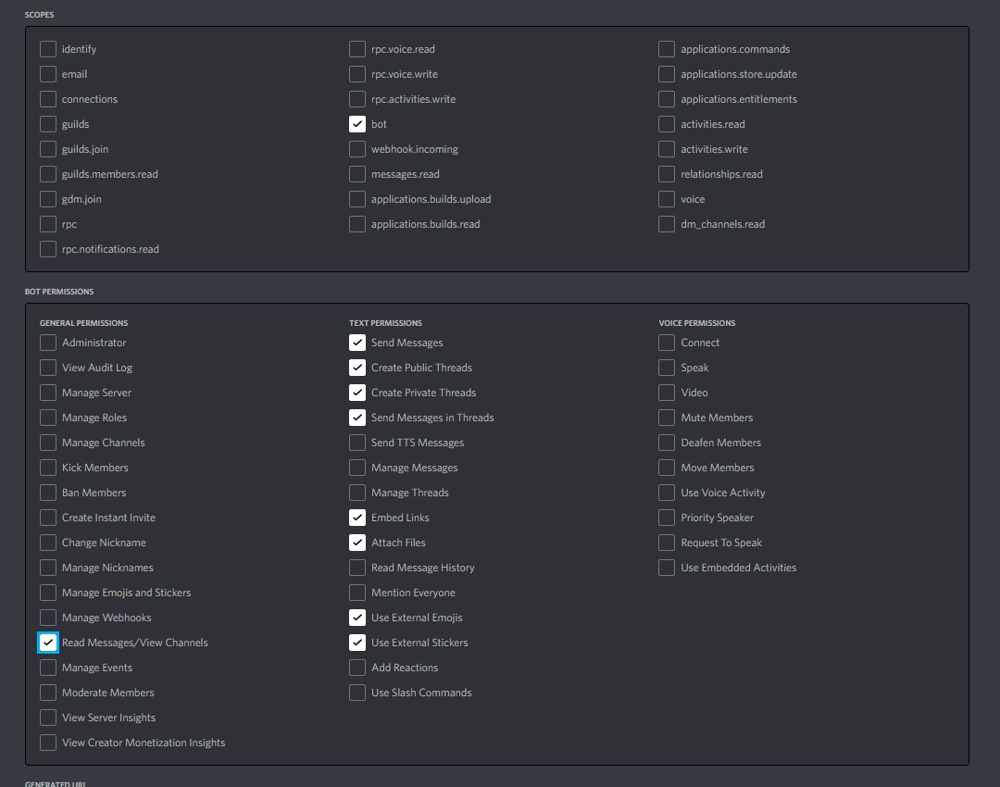

# Getting Started

## セットアップ

citation は以下の方法で利用できます。

1. ghcr.io(Github Packages)で公開されているビルド済みの Docker Image を使用する (推奨)
2. 自分自身でビルドし、jar ファイルを実行する
3. 配布されている jar ファイルを直接実行する (非推奨)

### 1. Bot を作成する

[Discord Developer Portal](https://discord.com/developers/applications) にアクセスし、新しいアプリケーションを作成します。

`New Application` をクリックし、アプリケーション名を入力し作成したら、`Bot` をクリックし、`Add Bot` をクリックします。

Bot を作成したら、`Reset Token` をクリックし、トークンを生成します。

!!! warning

    トークンは機密情報です。誰にも教えないでください。



### 2. Privileged Gateway Intents を有効にする

次に `Privileged Gateway Intents` を有効にします。

`Bot` メニューから `Privileged Gateway Intents` の欄にある、`MESSAGE CONTENT INTENT` を有効にします。



### 3. Bot をサーバーに招待する

OAuth2 の `URL Generator` から サーバーの招待リンクを生成します。

`SCOPES` に `bot` を追加し、`BOT PERMISSIONS` に適切な権限を設定します。citation に必要な権限は [citation に必要な権限](#citation-に必要な権限) を参照してください。

生成されたリンクから Bot をサーバーに招待します。



### 4. citation を入手する

=== "ghcr.io (Docker Compose) (推奨)"

    ここではghcr.io(GitHub Packages)にプッシュされているビルド済みイメージを **Docker Compose** で利用する方法を紹介します。

    **1. Dockerの環境を構築する**

    [Orientation and setup - Docker Documentation](https://docs.docker.com/get-started/) を参照しながらご自身のPC、またはサーバーにDockerを構築してください。

    **2. Docker Composeをインストールする**

    [Install Docker Compose - Docker Documentation](https://docs.docker.com/compose/install/) を参照しながらご自身のPC、またはサーバーにDocker Composeをインストールしてください。

    !!! note

        `1.` で準備したものはDocker Engineです。Docker Composeは別のものです。

    **3. 環境変数を作成する**

    適当なディレクトリを作成し `.env` ファイルを作成し、 [GitHubの `.env.example` ファイル](https://github.com/m2en/citation/blob/main/.env.example) を参考に環境変数を設定してください。

    ```.env
    # citationが接続するクライアントユーザーのトークン (Required)
    CITATION_BOT_TOKEN=

    # citationのコマンドを登録するギルドのID (Required)
    GUILD_ID=

    # /shutdown を実行できるユーザーのID (Required)
    SHUTDOWN_USER_ID=
    ```

    !!! warning "`SHUTDOWN_USER_ID` について"

        /shutdownはcitationのアクティブなプロセスを殺すコマンドです。

        当然実行されるとcitaionは停止します。この環境変数に指定するユーザーはcitationを再起動することができるユーザーに指定することをオススメします。

    **4. docker-compose.ymlを作成する**

    `.env` を作ったディレクトリに `docker-compose.yml` を作成し、以下の内容を記述してください。

    ```yaml
    version: "3.9"

    services:
        citation:
            image: ghcr.io/m2en/citation:latest
            restart: always
            env_file:
              - .env
    ```

    !!! note "services.citation.image の値"

        `services.citation.image` で `latest` と指定している場所はバージョンを指定することができます。(`latest` で常に最新版を使用します。)

        citationは重大な脆弱性があったりなど、一部の条件下を除いて基本的にすべてのバージョンを使用することができます。(それでも推奨しているのは最新版です。)

        利用可能なバージョンは GitHub の [Packages](https://github.com/users/m2en/packages/container/package/citation) ページで確認できます。

    **5. Composeでcitationを実行する**

    すべて記載できたら、以下のコマンドを実行してください。

    ```bash
    docker-compose up -d
    ```

    イメージのダウンロードが始まり、しばらくするとcitationが起動します。

=== "ghcr.io (Docker Image)"

    ここではghcr.io(GitHub Packages)にプッシュされているビルド済みイメージを **Docker Image** で利用する方法を説明します。

    **1. Dockerの環境を構築する**

    [Orientation and setup - Docker Documentation](https://docs.docker.com/get-started/) を参照しながらご自身のPC、またはサーバーにDockerを構築してください。

    **2. イメージを取得する**

    以下のコマンドを実行し、イメージを取得してください。

    ```bash
    docker pull ghcr.io/m2en/citation:latest
    ```

    **3. 環境変数を作成する**

    適当なディレクトリを作成し `.env` ファイルを作成し、 [GitHubの `.env.example` ファイル](https://github.com/m2en/citation/blob/main/.env.example) を参考に環境変数を設定してください。

    ```.env
    # citationが接続するクライアントユーザーのトークン (Required)
    CITATION_BOT_TOKEN=

    # citationのコマンドを登録するギルドのID (Required)
    GUILD_ID=

    # /shutdown を実行できるユーザーのID (Required)
    SHUTDOWN_USER_ID=
    ```

    !!! warning "`SHUTDOWN_USER_ID` について"

        /shutdownはcitationのアクティブなプロセスを殺すコマンドです。

        当然実行されるとcitaionは停止します。この環境変数に指定するユーザーはcitationを再起動することができるユーザーに指定することをオススメします。

    **4. コンテナを起動する**


    `.env` を作成したディレクトリに移動し次のコマンドを実行します。

    ```bash
    docker run --rm --env-file .env -t citation
    ```

    しばらくするとcitationが起動します。

=== "自分自身でビルドする(非推奨)"

    !!! warning "必要要件"

        Dockerを使用しないため、citationをホストするデバイスには以下の環境が必要です。

        - Java 17 (JDK 17)

        Gradleはデーモンとして付属しているので用意する必要はありません。

    次のコマンドを実行し、citationをビルドしてください。

    ```bash
    # ssh
    git clone git@github.com:m2en/citation.git

    # https
    git clone https://github.com/m2en/citation.git

    cd citation

    ./gradlew shadowJar
    ```

    適当なディレクトリを作成し `.env` ファイルを作成し、 [GitHubの `.env.example` ファイル](https://github.com/m2en/citation/blob/main/.env.example) を参考に環境変数を設定してください。

    ```.env
    # citationが接続するクライアントユーザーのトークン (Required)
    CITATION_BOT_TOKEN=

    # citationのコマンドを登録するギルドのID (Required)
    GUILD_ID=

    # /shutdown を実行できるユーザーのID (Required)
    SHUTDOWN_USER_ID=
    ```

    !!! warning "`SHUTDOWN_USER_ID` について"

        /shutdownはcitationのアクティブなプロセスを殺すコマンドです。

        当然実行されるとcitaionは停止します。この環境変数に指定するユーザーはcitationを再起動することができるユーザーに指定することをオススメします。

    `.env` をcitationのルートディレクトリ上に設置し、次のコマンドを実行します。

    ```bash
    java -jar build/libs/citation.jar
    ```

    `citation ready!` と表示されたら成功です。

---

## citation に必要な権限

citation が接続するクライアントユーザーに必要な権限は以下の通りです。

- `Send_Messages` (メッセージの送信権限)
- `Send_Messages_in_Threads` (スレッドでのメッセージ送信権限)
- `Embeds_Links` (リンクの埋め込み権限)
- `Attach Files` (添付ファイル送信権限)
- `Read Messages / View Channels` (メッセージ、チャンネルの閲覧権限)

以下の権限はなくても使えますが、つけれるならつけておくと得な権限です。

- `Use External Emojis` (別鯖の絵文字使用権限)
- `Use External Sticker` (別鯖のステッカー使用権限)

!!! warning "Administator 権限は付与しないでください"

    `Administrator` 権限は非常に強い権限です。

    サーバー所有者とほぼ同等の権限を持つため、万が一トークンが漏洩した場合、不正利用される可能性があり危険です。

    (サーバーのメンバーを全員BANし、再起不能にする荒らし 通称 `Server-Nuke` に悪用される場合があります)

## アップデートする

citation のパッチが配信されると [Releases](https://github.com/m2en/citation/releases) ページが更新されます。

以下の手順に従って更新を行ってください。

=== "ghcr.io (Docker Compose)"

    **1. `docker-compose.yml` を開き、イメージのバージョンを更新します。**

    ```yaml
    version: "3.9"

    services:
      citation:
        image: ghcr.io/m2en/citation:latest
        container_name: citation
        restart: always
        env_file: .env
    ```

    !!! note

        `services.citation.image` の値を `latest` にしている場合は変更の必要はありません。

    **2. `docker-compose.yml` を保存し、次のコマンドでイメージの削除及び、コンテナの殺害を行います。**

    ```bash
    docker-compose down
    ```

    **3. 再起動を行います。**

    ```bash
    docker-compose up -d
    ```

=== "ghcr.io (Docker Image)"

    **1. アクティブのコンテナを停止します。**

    ```bash
    docker container rm <CONTAINER_ID>
    ```

    **2. イメージを削除します。**

    ```bash
    docker image rm -f <IMAGE_ID>
    ```

    **3. 新しいイメージをPullします。**

    ```bash
    docker pull ghcr.io/m2en/citation:latest
    ```

    **4. 再起動します**

    ```bash
    docker run --rm --env-file .env -d <IMAGE_ID>
    ```

=== "自身でビルドしている場合"

    **1. 最新の状態をPullします。**

    ```bash
    git pull
    ```

    **2. ビルドします。**

    ```bash
    ./gradlew shadowJar
    ```

    **3. 再起動します。**

    ```bash
    java -jar build/libs/citation.jar
    ```

---
