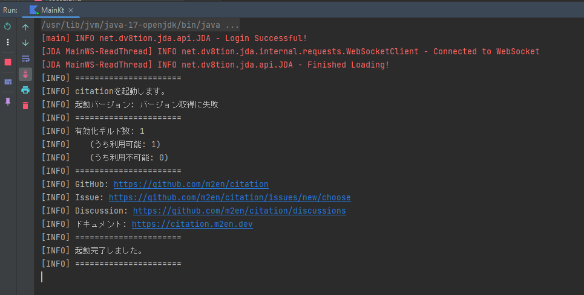

# Migration v1 to v2
> v1 から v2 への移行

## はじめに

このページは citation v1 から v2 への移行に関するガイドです。

## v2のインストール

v2 以降からはDockerでのセットアップのみを推奨しています。

以下のコマンドを実行して v2 をインストールしてください。

```shell
# latest タグからプルする
docker pull ghcr.io/m2en/citation:latest

# v2.0.0 タグからプルする
docker pull ghcr.io/m2en/citation:v2.0.0
```

詳しいセットアップ方法については [Getting Started](./getting-started.md) を参照してください。

## コマンドの再登録

v2 では同じコマンドを利用できるようになっていますが、互換性保持のため、コマンドの再登録を推奨しています。

### 1. コマンドを削除する

citation v1 で登録されているコマンドを削除します。

以下のエンドポイントに対して `DELETE` リクエストを送信します。

```https
DELETE /applications/{application.id}/guilds/{guild.id}/commands/{command.id}
```

| value | description                                                  |
| ---- |--------------------------------------------------------------|
| `application.id` | アプリケーション ID (Applicationsページ, "General Information" にてコピー可能) |
| `guild.id` | サーバー ID (Discordクライアントからコピー可能)                               |
| `command.id` | コマンド ID (Discordクライアントからコピー可能。)                     |


!!! example
    ```shell
    curl -X DELETE \
        -H "Authorization: Bot <token>" \
        https://discord.com/api/v10/applications/1234567890/guilds/1234567890/commands/1234567890
    ```

### 2. コマンドの再登録

v2 で推奨されているコマンドを再登録します。

起動時に再登録されますので、そのまま起動してください。

### 4. コマンドが再登録されているかどうか確認する

起動が完了すると以下の情報がコンソールに表示されます。



正しく起動できなかった場合は [Troubleshooting](./troubleshooting.md) ページを参照してください。

## テストする

citation v2が正しく動作するかの確認を行ってください。

以下はチェックリストです。

!!! example テストする内容

    1. メッセージリンクを送信しEmbedが返ってくるか
    2. <>をつけて、Embedが返ってこなくなっているか
    3. /help でEmbedが返ってくるか
    4. /shutdownで正しく停止するか
    5. /docs, /githubで正しく検索できるか
    6. /docs, /githubの値補完(AutoComplete)が正しく動作するか

v2 がリリースされてからしばらくはベータ版として配信します。

不具合を見つけた場合は [GitHub Issues](https://github.com/m2en/citation/issues/new) から報告してください。
