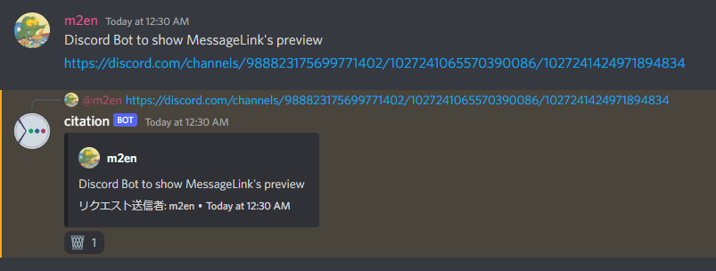

# 引用

citation の基本機能 **引用について**

## 引用を行う

citation の引用機能は、citation が閲覧できメッセージを送信できるチャンネルで、メッセージリンクを送るだけで利用できます。



!!! example

    ```md
    https://discord.com/channels/123456789012345678/123456789012345678/123456789012345678
    ```

## 引用をスキップする

メッセージリンクだけ送りたいときや、citation に反応されたくないときはメッセージリンクを `<>` で囲みます。

!!! example

    ```md
    <https://discord.com/channels/123456789012345678/123456789012345678/123456789012345678>
    ```

## 引用を削除する

引用を削除する際は、引用したメッセージに送信された `🗑️` リアクションを押すだけです。

!!! warning "citation をブロックした際の挙動"

    citation をブロックした場合、引用したメッセージに `🗑️` リアクション は送信されません。ご注意ください。

!!! note "メッセージ管理権限を持つユーザーの場合"

    メッセージ管理権限を持つユーザーは、引用したメッセージに送信された `🗑️` リアクションを押すと引用者ではなくても削除されます。

## 制限

### スポイラーの画像

スポイラーされた画像は Embed に表示されず、リンクのみ表示されます。

リンク先はスポイラーされていないので、リンクを開く際は注意してください。

### NSFW チャンネル

NSFW チャンネル内のコンテンツは NSFW チャンネル外で引用することはできません。

NSFW チャンネル内で引用することは可能です。

### フォーラムチャンネル

フォーラムチャンネル内のコンテンツはフォーラムチャンネル外で引用することはできません。

### citation が引用できないメッセージ

以下の条件に当てはまるメッセージは citation が引用できません。

- システムメッセージ
- 画像以外の添付ファイル
- Sticker
- Webhook のメッセージ
- メッセージ内容が空で、Embed のみのメッセージ
- チャンネルが存在しないメッセージ
- 引用元のギルドと引用を利用するギルドが異なるメッセージ
