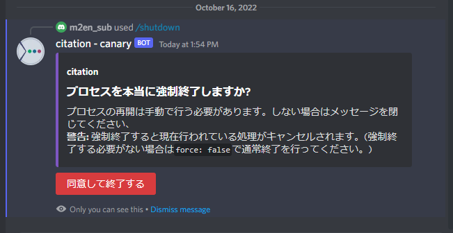

# シャットダウン

## シャットダウンについて

`/shutdown` コマンドで現在アクティブなcitationのプロセスを終了することができます。

このコマンドは外部に影響を及ぼすため、環境変数 `SHUTDOWN_USER_ID` が指定されているユーザーのみ使うことができます。

!!! warning "封印する"

    このシャットダウンコマンドを使いたくない場合は環境変数を空の状態にして、CommandPermissionを使い完全封印することができます。

    詳しい設定方法は公式ヘルプ記事を御覧ください。

    [Command Permissions - Discordヘルプセンター](https://support.discord.com/hc/en-us/articles/4644915651095)

## 強制終了について

`force` オプションで `true` にし、実行すると強制終了するかどうかを確認されます。

`false` の通常終了と違う点として現在アクティブなJDAのイベントスレッドが強制終了するか、しないかの違いです。
